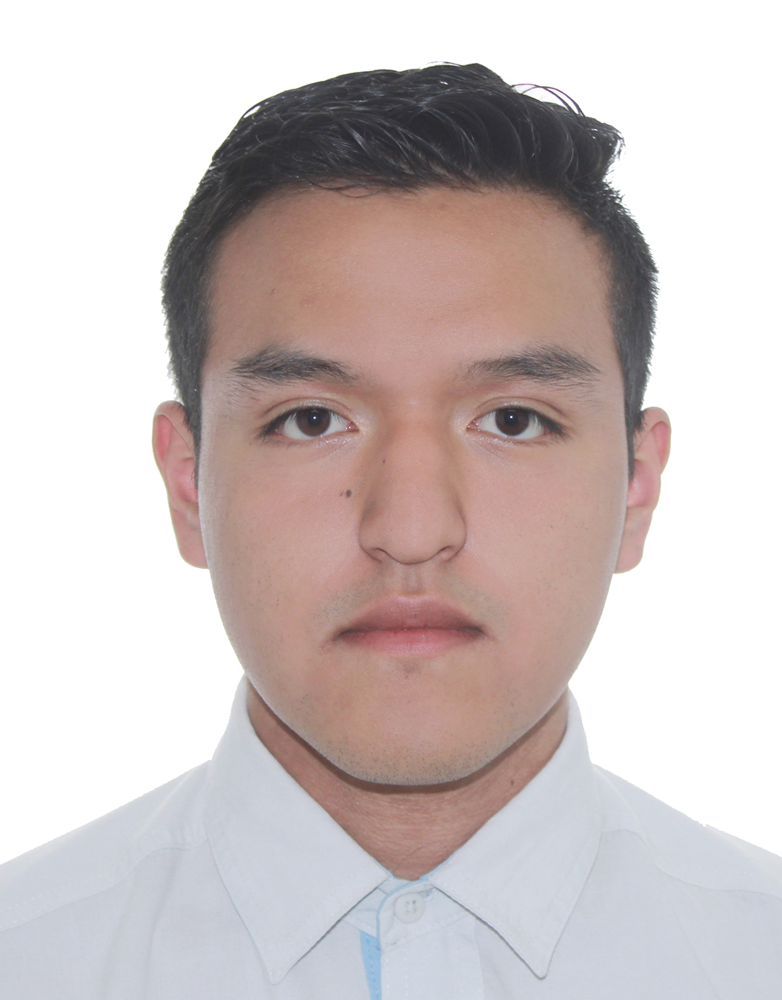

## 👋 About Me

  

I'm an undergraduate Technology student at **ENES Juriquilla, UNAM**, currently in my fifth semester.

My research interests focus on the intersection of **Artificial Intelligence, Engineering, Physics, and Biology**. I enjoy applying computational methods to scientific and engineering challenges.

### 🔬 Current Research Areas

- 🧲 Magnetic Resonance Imaging (MRI)
- 🧠 Deep Learning for Biomedical Data
- 📈 Mathematical Modeling
- 🚀 Aerospace Systems

### 💻 Technologies & Interests

- Python
- Machine Learning
- Signal Processing
- Scientific Computing
- Research Software Development

I aspire to develop technologies that bridge scientific research and engineering, creating solutions with meaningful real-world impact.
